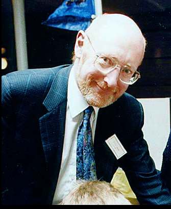

1. Sir Clive Marles Sinclair byl britský podnikatel známý díky rozšíření tzv. domácích počítačů, který si lidé již mohli dovolit.
2. Ve 43 letech mu byl udělet titul Sir.
3. Dva známý domací počítače firmy Sinclair Research byly modely ZX80, ZX81.
4. Firma nakonec upadla, jelikož se jejich očekávaný počítač Sinclair QL dostal na trh s mnoha bugy.
5. Mimo jiné také vyvíjel elektromobily (Sinclair C5).

  
